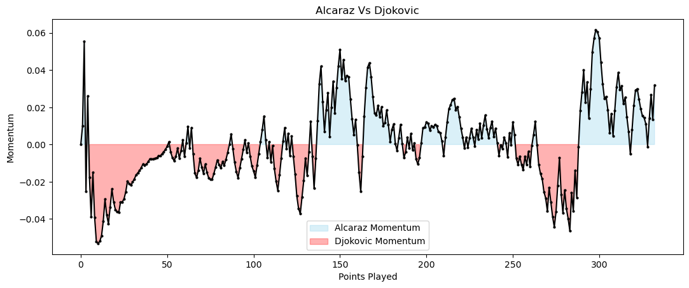
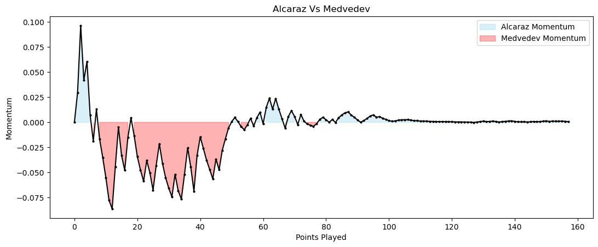
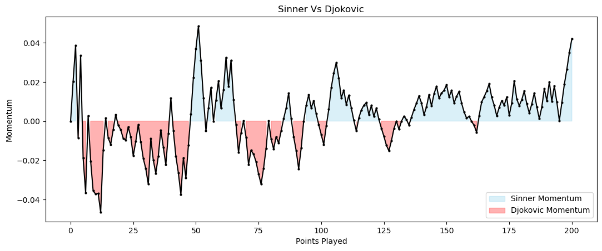
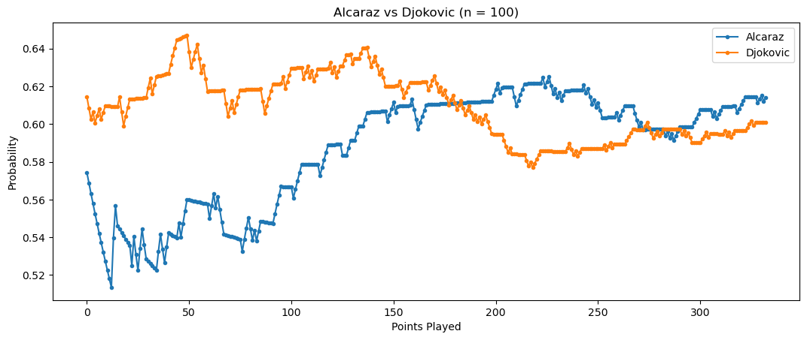
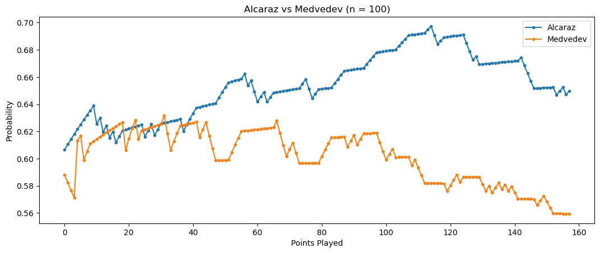
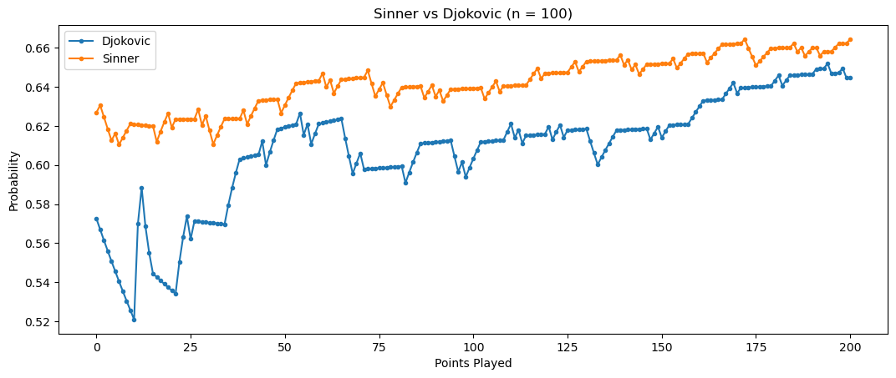

# Quantifying Momentum in Tennis
This repository provides implementations of and data pertaining to the models created as a part of the Mathematics Competition in Modelling (MCM) run by the Consortium for Mathematics and its Applications (COMAP).Below provides a breif description of out model and necessary terms.

Momentum is sports matches tends to take on a multitude of definitions depending on the context of its use. In some sense, it has become a "catch-all" in sports media and is often used when teams begin to take control of the match [1,2,3]. However, it is difficult to build models to quantify this phenomenon when it has such an elusive definition. Thus the next section of this Readme is focused on defining this sporting term.

## Leverage and Momentum
We utilize definition of Momentum that have precendent drawing from the work of Seidel and Lucey [4]. Before we can define momentum in the context of tennis matches, we will need to define the concept of leverage and some supporting notation. We will let $S_{m}$ denote the score sequence up to the $m^{\text{th}}$ point, $s_i$ be the $i^{\text{th}}$ point of the match, and $M$ be the random variable describing wether a player wins the match. With this we define leverage, denoted $\ell$, to be the difference between the match win probability that the given player wins the next point and the match win probability that the given player loses the next point. Thus, leverage is given by the following.

$$
\begin{equation}
\ell_t =   P(M=1 | s_t = 1) - P(M=1 | s_t = 0)
\end{equation}
$$

With leverage, we then define momentum to be exponentially weighted sum of leverages accross the match.

$$
\begin{equation}
\mathcal{M_t} =  \frac{\ell_t + (1-\alpha)\ell_{t-1} + (1-\alpha)^2\ell_{t-1} + \dots + (1-\alpha)^t\ell_0}{1 + (1-\alpha) + (1-\alpha)^2 + \dots + (1-\alpha)^t}
\end{equation}
$$

where $\alpha$ is a smoothing factor that determines the important with wich we consider past events.

Thus, as long as we can accurately predict the outcome of a match given then next point, we can quantify momentum. Of course, this is a whole other problem which must be solve and to which we provide yet another model described later.

## Interpreting Momentum
Using this definition of momentum results in some interesting and rather unintuitive artifacts when alayzing matches. When a match is close, every point matters and so we expect to see rallies that end in high momentum for a particular player. However, matches that are blowouts tend to have little to no momentum. At first this may seem like an inaccuracy in the model implementation, but it is in fact what we would expect given our model definition. Once a player has built an incredible lead in the match, the result of a single rally has little to no effect on the outcome of the match. Thus leverage remains small, and momentum as a function of leverage does as well.

So if momentum does not provide a way to determine who is winning the match, what exactly is it? Taking a step back, momentum can be understood as an indicator for high importance rallies in tennis matches. A moment in the match exhibiting high momentum indicates that the probability of a player winning the match is significantly changing. Over the non-differentiable function of match win probability, momentum provides an understanding of change and the rate with which it is happening.

Thus momentum tells us who is taking control of the match. Match win probability already exists as a metric to determine who is in control of the match. Making this distinction between the two is important in interpreting momentum and making good use of it.

## Momentum Results
---

---

---

## Calculating Match Win Probability
#### Overview
Rallies win games. Games win sets. Sets win Matches. Thus a good place to start in understanding the match win probability of a player is quantifying the probability with which they will win the next rally. 

Anyone who has follows tennis understands that there is a significant advantage for a player to win a rally when they are serving. However, as shown by Newton and Keller, there is no theoretical advantage in serving first within a match [5]. Thus we add a qualifier to rally win probability and consider the probability that player $i$ will win a rally on player $j$ and vice versa.

#### Rally Win Probability Equations
To calculate these probabilities, equtions defined in a paper by Barnett and Clarke are used [6]. First we define important variables in these equations.

| Symbol | Description |
|--------|-------------|
| $a_i$ | Percentage of first serve in play for player $i$ |
| $b_i$ | Percentage of points won on first serve for player $i$ |
| $c_i$ | Percentage of points won on second serve for player $i$ |
| $d_i$ | Percentage of points won on return of first serve for player $i$ |
| $e_i$ | Percentage of points won on return of second serve for player $i$ |

Then we define $f_i$ to be the rally win probability of player $i$ while serving and $g_i$ to be the rally win probability of player $i$ while receiving.
$$
\begin{equation}
f_i = a_i b_i + (1 - a_i) c_i
\end{equation}
$$
$$
\begin{equation}
g_i = a_{avg} d_i + (1 - a_{avg}) e_i
\end{equation}
$$
With these proabilities for each player, we can predict the rally win probabilities for a matchup between player $i$ and $j$ [6].

$$
\begin{equation}
f_{ij} = (f_i - f_{avg}) - (g_j - g_{avg})
\end{equation}
$$

And

$$
\begin{equation}
g_{ji} = (g_j - g_{avg}) - (f_i - f_{avg})
\end{equation}
$$

#### Rally Win Probability Dynamic Update Model
With a prediction of rally win probabilities for a matchup between player $i$ and $j$, Kovalchik and Reid define a dynamic update model[7]. This dynamic model weighs the pre-match predicted probability a player wins a rally on serve against their actual performance in match. The model is given by by

$$
\begin{equation}
\hat{p}_{ij}(S_m) = \Theta(S_m)\pi_{ij} + (1-\Theta(S_m))\overline{p}_{ij}(S_m)
\end{equation}
$$

where theta is given by

$$
\Theta(S_m) = \frac{n_0}{n_0+m}
$$

#### Match Win Probability
Using combinitorics and a program described in Kovalchik and Reid [7], we can calculate the match win probability at each point in the match. We can then simulate the win or loss of the next point to calculate leverage and momentum.

#### Rally Win Dynamic Update Results
---

---

---

## References
[1]: Brooks Hays. ’Momentum’ in sports is malarkey, researchers say. Feb. 2014. url: https://www.upi.com/Science_News/2014/02/18/Momentum-in-sports-is-malarkey-researchers-say/9351392739888/

[2]: David Hale. Is momentum real? an in-depth investigation of sports’ most overused term. url: https://www.espn.com/college-football/story/_/id/32910904/is-momentum-real-depth-investigation-sports-most-overused-term

[3]: Paul J. Roebber, Bryan M. Burlingame, and Anthony deWinter. “On the existence of momentum in professional football”. In: PLOS ONE 17.6 (June 2022). doi: 10.1371journal.pone.0269604

[4]: Robert Seidl and Patrick Lucey. “Live Counter-Factual Analysis in Women’s Tennis using Automatic Key-Moment Detection”. In: MIT Sloan Sports Analytics Conference. Boston, MA, Mar. 2022. url: https://www.researchgate.net/publication/364238338_Live_Counter-Factual_Analysis_in_Women%27s_Tennis_using_Automatic_Key-Moment_Detection.

[5]: Paul K Newton and Joseph B Keller. “Probability of winning at tennis I. Theory and data”.In: Studies in applied Mathematics 114.3 (2005), pp. 241–269. doi: 10.1111/j.0022-2526.2005.01547.x

[6]: Tristan Barnett and Stephen Clarke. “Combining player statistics to predict outcomes of tennis matches”. In: IMA Journal of Management Mathematics 16 (Apr. 2005), pp. 113–120. doi: 10.1093/imaman/dpi001

[7]: Stephanie Kovalchik and Machar Reid. “A calibration method with dynamic updates for within-match forecasting of wins in tennis”. In: International Journal of Forecasting 35.2 (Apr. 2019), pp. 756–766. doi: 10.1016/j.ijforecast.2017.11.008